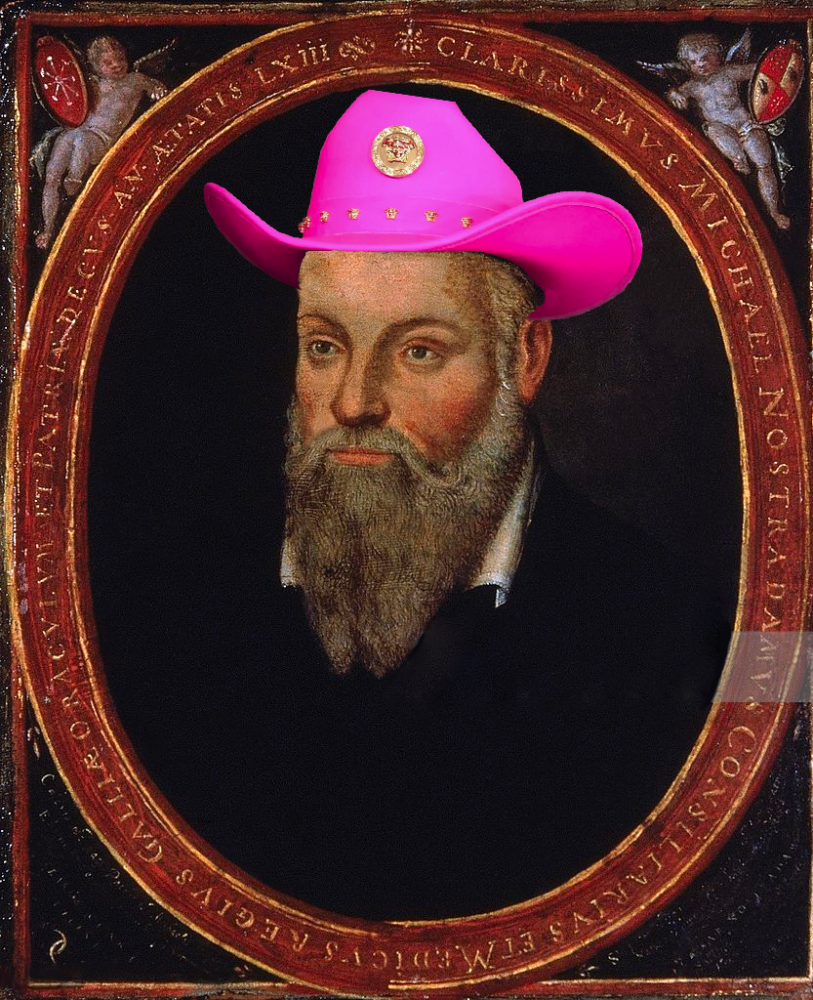
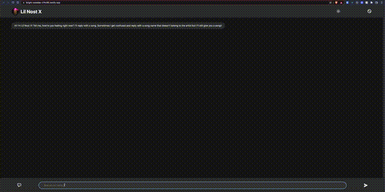
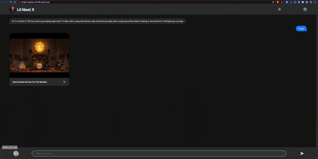
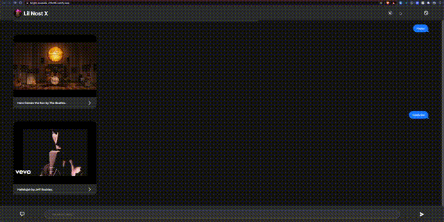
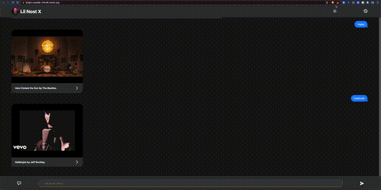

# Fun With AI - Frontend

<a href='https://www.youtube.com/watch?v=UTHLKHL_whs'>
    
</a>

<p style='font-size:30px;'> 🔗 <a href='https://bright-cassata-c74c95.netlify.app/'>Demo</a></p>

This repo is for the Fun With AI frontend.
It lets you talk to Lil Nost X, the illustrious psychic who can give you a song based on your mood! Just type in how you are feeling or choose from a few pre-approved moods selected by the Nost himself.

### Design 🎨

---

I wanted to create the UI of this app in the form of a chat to give the user some comfortability and make the conversation with the AI feel as natural as possible.

I took design influence from Apple's Messages and Facebook's Messenger chat UI's and tweaked it to fit all the necessary features specific for this app.

### Development Process 👨‍🏫

---

I used ZenHub's integration with Github to plan issues and link them to pulll requests.

For git I created a dev branch where all merge commits went into while developing the features for the app. I always made sure to branch off of dev while working on features.

I used shopify's eslint rules and prettier configs to maintain code consistency, and I also used Husky to check for formatting and type errors before I could git commit.

## Installation 🕝

---

Use the package manager <a href='https://docs.npmjs.com/downloading-and-installing-node-js-and-npm'>npm</a> to install this project.<br/>
<br/>
Once you have cloned the project run:

```bash
npm install
```

This will install all necessary dependencies.

## Build 🛠

---

To run this project go to the root of the directory and run:

```bash
npm run build
npm start
```

This will build a production version of the project and then start it on localhost:3000 if available.

## Development Mode 👨‍💻

---

If you want to run it in development mode, run:

```bash
npm run dev
```

This will also start up the project on localhost:3000 but in development mode.

## Usage 📝

---

## Using the chat bar

<br/>


<br/>
When you start up the app you are greeted with a welcome message.
<br/>
<br/>
From here you are able to type into the chat bar and send a message to Lil Nost X. A response in the form of a Youtube Video link and song title will be sent back

## Using the preset prompts menu

<br/>


<br/>
You can also select a preset prompt from the prompt menu on the left.
<br/>
<br/>
This will send a prompt message when clicked and Lil Nost X will give back a response just like if you type the message.

## Clearing the chat contents

<br/>


<br/>
If you hate Lil Nost X's suggestions or if you want to clear your chat history with the X there is a handy clear button on the top right to do just that!

## Dark/Light Mode

<br/>


<br/>
The chat defaults to your system appearance, but if you want you can toggle dark/light mode at will. Personally I'm a dark mode kinda person but you now get a choice!

## Technologies 🖥

---

<table>
    <thead>
        <tr>
            <th>Languages 🔤</th>
        </tr>
    </thead>
    <tbody>
        <tr>
            <td>
                <a href='https://www.typescriptlang.org/'>
                    
                </a>
            </td>
            <td>
                <a href='https://www.typescriptlang.org/'>TypeScript</a>
            </td>
        </tr>
        <tr>
            <td>
                <a href='https://html.spec.whatwg.org/'>
                    
                </a>
            </td>
            <td>
                <a href='https://html.spec.whatwg.org/'>HTML5
                </a>
            </td>
        </tr>
        <tr>
            <td>
                <a href='https://www.w3.org/TR/CSS/#css'>
                
                </a>
            </td>
            <td>
                <a href='https://www.w3.org/TR/CSS/#css'>CSS3
                </a>
            </td>
        </tr>
    </tbody>
</table>

<table>
    <thead>
        <tr>
            <th>Frameworks ⚙️</th>
        </tr>
    </thead>
    <tbody>
        <tr>
            <td>
            <a href='https://reactjs.org/'>
                
            </a>
            </td>
            <td>
                <a href='https://reactjs.org/'>React</a>
            </td>
        </tr>
        <tr>
            <td>
            <a href='https://nextjs.org/'>
                
            </a>
            </td>
            <td>
                <a href='https://nextjs.org/'>Next.js</a>
            </td>
        </tr>
    </tbody>
</table>

<table>
    <thead>
        <tr>
            <th>Packages 📦</th>
        </tr>
    </thead>
    <tbody>
        <tr>
            <td>
                <a href='https://www.npmjs.com/package/classnames'>
                    
                </a>
            </td>
            <td>
                <a href='https://www.npmjs.com/package/classnames'>Classnames</a>
            </td>
        </tr>
        <tr>
            <td>
            <a href='https://openai.com/'>
                
            </a>
            </td>
            <td>
                <a href='https://openai.com/'>OpenAI</a>
            </td>
        </tr>
        <tr>
            <td>
            <a href='https://www.npmjs.com/package/uuid'>
                
            </a>
            </td>
            <td>
                <a href='https://www.npmjs.com/package/uuid'>UUID</a>
            </td>
        </tr>
    </tbody>
</table>

## Credits 📀

---

Third-party APIs provided by <a href='https://openai.com/api/'>OpenAI</a> & <a href='https://developers.google.com/youtube/v3'>Google Youtube API</a>.
<br/>
<br/>
SVG Icons provided by <a href='https://heroicons.com/'>Hero Icons</a>.
<br/>
<br/>
Image of Nostradamus sourced from <a href='https://upload.wikimedia.org/wikipedia/commons/c/c6/Nostradamus_by_Cesar.jpg'>Wikipedia</a> with Lil Nas X's hat photo edited by Me.
<br/>
<br/>
Design influenced by <a href='https://support.apple.com/messages'>Apple Messages</a> & Facebook's <a href='https://www.messenger.com/'>Messenger</a>.
<br/>
<br/>
